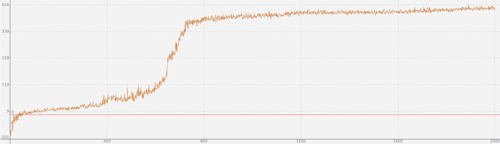

# biosphere

golang genetic algorithm

## examples

### Robot Roby

## 生命游戏

### 目标

* 生存
* 繁衍
* 进化

### 规则

* 生命有活力
  * 用数字表示
  * 可以增加减少
  * 每次行动减少活力
* 亲近活力多
  * 增加大量活力
* 近亲活力少
  * 增加少量活力

### 行为

1. 上
1. 下
1. 左
1. 右
1. 随机
1. 亲近
1. 繁殖(训练过程不实现)
   * 训练过程随机布局
   * 运行过程亲近高活力目标进行繁殖

### 格子状态

4 x 4 x 4 x 4 x 4 = 1024

1. 空格子: 0
1. 墙壁: 1
1. 高活力: 2
1. 低活力: 3

### 判定

* 移动: 活力-1
  * 撞墙: 扣5分
* 亲近：活力-1
  * 高活力+10分
  * 低活力+5分
  * 没有对象-1分
